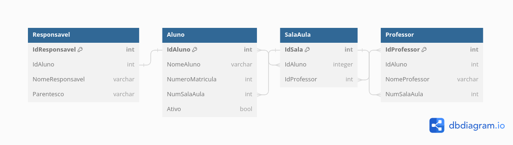

# Infnet-Persistence-Java-Proj
Projeto sobre persistência de dados com Java.

## 💻 Pré-requisitos

Antes de começar, verifique se você atendeu aos seguintes requisitos:
* Ter instalada a versão do Java JDK 17 ou superior;
* Ter instalado o Apache Maven 3.x.x;
* Utilizar uma IDE para Java - Eclipse, IntelliJ ou Visual Studio Code;
* Ter instalado o Docker e Docker Compose;
* Utilizar um gerenciador de base de dados de sua preferência.

## 🚀 Realizando o Setup e Executando o Projeto

Faça o clone do repositório e:

1. Na pasta **docker**, encontrada na raiz do projeto, execute o comando *docker compose up -d* para subir o banco;
2. Abra o seu gerenciador de base de dados;
3. Execute o arquivo schema.sql, encontrado na pasta resources do projeto, para criar a instância de dados;
4. Depois disso, execute a classe Main, dentro do pacote de testes do projeto.

## 🎲 Diagrama da Base de Dados

Abaixo, a imagem contendo o diagrama da base de dados utilizado para implementar nosso ORM.

## 👨‍💻 Outros:

- O projeto também possui a construção, um início de uma dsl para criação de banco usando JDBC. Constam apenas métodos de criação de base de dados e tabela.

---
